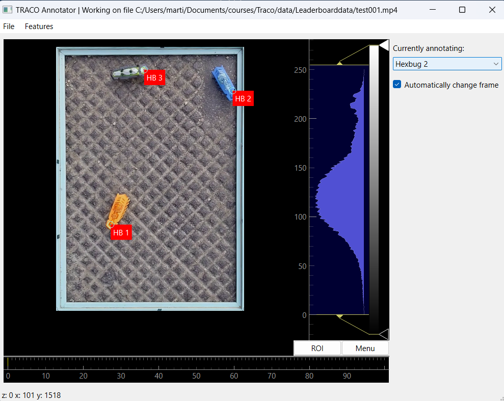
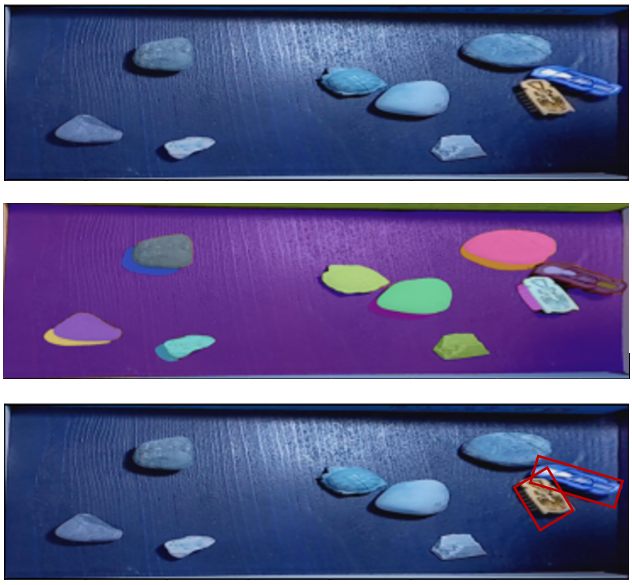
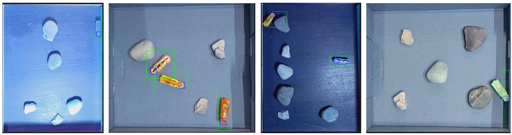

# Tracking Hexbugs Project

This project, developed for the *Tracking Olympiad* seminar (SS 2024), focuses on tracking Hexbugs—small, vibrating, bug-like devices that move randomly. The primary goal was to explore methods for accurately detecting and tracking these objects in videos, especially given challenges such as low frame rates and erratic movements.

Disclaimer: This is a quick implementation project. 

---

## Table of Contents

1. [Project Overview](#project-overview)
2. [Setup Instructions](#setup-instructions)
3. [Project Structure](#project-structure)
4. [Experiment Settings](#experiment-settings)
5. [Methodology](#methodology)
6. [Demo](#demo)
7. [Results and Key Findings](#results-and-key-findings)

---

## Project Overview

The main focus of this project was to detect and track Hexbug heads in videos. Given the unique challenges posed by the dataset, such as:
- Small object sizes
- Low frame rates
- Erratic object movement

We used a combination of detection models and tracking algorithms to achieve the objective.

Key highlights:
- **Detection Models:** Two approaches were explored:
  1. Head-only detection using YOLOv8.
  2. Head and body detection using YOLOv8, with body labels generated via the Segment Anything Model (SAM).
- **Tracking Methods:** 
  1. Minimal Euclidean distance-based tracking.
  2. Lucas-Kanade optical flow-based tracking.

---

## Setup Instructions

### Environment Setup
1. **Python Environment:** Create Python environments using `requirements.txt` in the respective directories (e.g., GUI, tracking).
2. **Dependencies:** Install required libraries:
   ```bash
   pip install -r requirements.txt
3. **Ultralytics library:**
  - Use the custom forked version of the Ultralytics library provided in this project.
  - Install it using: pip install path/to/ultralytics.zip


## Data and Models
- Dataset: Place videos or extracted frames in the data/ directory.
- YOLO Models:
  - head_black_best.pt: Head-only detection model.
  - head_body_model_best.pt: Head and body detection model.
- SAM Weights: Download and set up SAM weights for body label generation.


## Usage
1. Generate Body Labels: Run SAM4Labels/generate_body_labels.ipynb to generate body labels from head labels using SAM.
2. Training: Train YOLO detection models using src/training/train.ipynb.
3. Tracking Inference: Run tracking using src/tracking/tracking_inference.py.


## Project Structure
```md
Hexbug_Tracking_Project/
├── data/                      # Datasets (not included in repository)
├── gui/                       # GUI for labeling
│   ├── gui.py                 # Main labeling tool script
│   ├── requirements.txt       # GUI environment dependencies
│   └── validate_gui_output.ipynb  # Validation and visualization
├── models/                    # our-trained YOLO models
├── SAM4Labels/                # Body label generation using SAM
├── src/                       # Source code for detection, tracking, and visualization
│   ├── data_preparation/      # Preprocessing scripts
│   ├── tracking/              # Tracking inference
│   ├── training/              # YOLO training scripts
│   └── viz/                   # Visualization scripts
├── media/                     # Media (images, gifs, results)
│   └── trackinggifs/          # Demo gifs
└── results/                   # Results (e.g., tracking outputs, videos)
```

## Experiment Settings

### Annotation Process
- The labeling process was performed using a custom fork of the TRACO Labeling Tool.
- Labels initially consisted of **center points** for Hexbug heads instead of bounding boxes. To use these labels for YOLO training, fixed-size bounding boxes were later generated around the center points.

### Body Label Generation with SAM
- To enhance detection and tracking performance, **body labels** were generated using Meta's **Segment Anything Model (SAM)**.
- The process involved:
  - Segmenting the entire frame into potential objects using SAM.
  - Matching YOLO-detected head positions with SAM segments using Intersection over Union (IoU).
  - Selecting the best-matched segment for each head detection, refining it by expanding its size by 20%.
- These generated labels helped in training a more robust YOLO model with both head (class 0) and body (class 1) annotations.

### Images for Experiment
#### Custom Labeling Process
This image illustrates the process of manually annotating head positions and generating bounding boxes for YOLO training:


#### SAM Body Label Generation
This image shows the steps in using SAM for generating body labels:
- Top: Original frame.
- Middle: SAM-generated segments.
- Bottom: Resulting bounding boxes for heads (YOLO detections) and bodies (SAM refinement).


#### Good and Bad Examples of SAM
This image shows two good examples where SAM worked well and two cases where it failed:



#### Detection and Tracking Failures
This image shows common detection and tracking issues, such as:
- Missed detections.
- ID switches during collisions or occlusions.


---

## Methodology

### Detection
Two detection approaches were implemented:
1. **Head-only Detection:**
   - YOLO was trained with head labels only (`class 0`).
2. **Head and Body Detection:**
   - YOLO was trained with both head (`class 0`) and body (`class 1`) labels.
   - Body labels were generated using SAM for better performance in tracking Hexbugs.

### Tracking
Two tracking methods were evaluated:
1. **Minimal Euclidean Distance Tracking:**
   - Tracks detected heads across frames based on the smallest Euclidean distance between detections in consecutive frames.
   - Assumes a fixed number of Hexbugs and handles missing detections by retaining their last known positions.
2. **Lucas-Kanade Optical Flow Tracking:**
   - Uses optical flow to predict object movement between frames.
   - Matches tracked objects with YOLO detections based on proximity.

---

## Demo

The following gifs showcase the tracking results for the 5 test videos.
Here the first frame of each of the test videos: 


| Video Name                  | Tracking Demo                                    |
|-----------------------------|-------------------------------------------------|
| `run_214_head_b_ed_001.gif` |  |
| `run_214_head_b_ed_002.gif` |  |
| `run_214_head_b_ed_003.gif` |  |
| `run_214_head_b_ed_004.gif` |  |
| `run_214_head_b_ed_005.gif` |  |

---

## Results and Key Findings

### Detection
1. **Body-head detection** showed superior performance in scenarios with occlusions or collisions.
2. **Head-only detection** struggled in complex cases but performed well in simpler scenarios.

### Tracking
1. **Minimal Euclidean Distance Tracking:**
   - Simpler and faster but prone to ID switching in challenging situations (e.g., collisions).
2. **Lucas-Kanade Optical Flow Tracking:**
   - More robust to challenging scenarios but computationally more expensive.

### Challenges
- Frequent **ID switching** during collisions.
- Difficulty in **tracking Hexbugs** that lay flat or became partially obscured.
